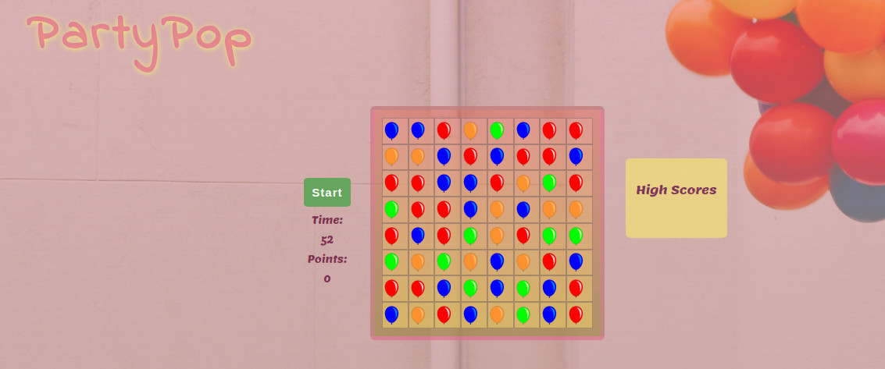
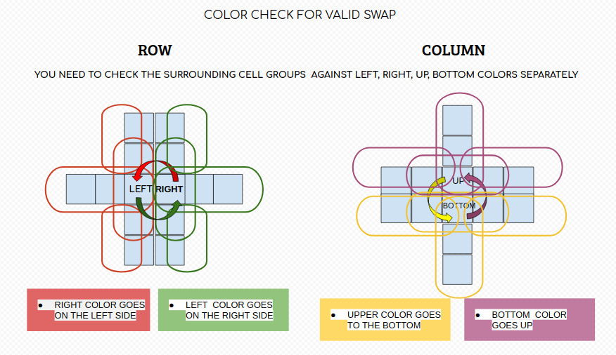

# partyPop

# Overview


This was a solo project for one week duration. The idea was to re-create an existing game using only HTML, CSS and vanilla JavaScript. Therefore I haven't use any frameworks or pre-built components. This made sure to creat logic from scratch and to get comfortable with JavaScript and DOM relationship.
I decided to make a Candy Crush inspired project as my first of the Software Engineering Immersive course at General Assembly London. 

You can find my deployed game here: [partyPop🎈](csillabarna.github.io/project-1/)


## Brief

- Render a game in the browser
- Include separate HTML / CSS / JavaScript files
- Use vanilla Javascript for DOM manipulation
- Display results in the end
- Deploy your game online


## Technologies used
- HTML5
- CSS3
- JavaScript 
- Git and GitHub
- Google Fonts

## The Game
Candy Crush is a game where players swap colored pieces of candy on a game board to make a match of three or more of the same color in either a row or column. Players can swap any candy on the board as long as it will make a 'crush', so they can't swap two candies if doesn't create a row or column of candies of the same color. New random candies are generated at the top so there is a continuous fall of candy as the user crushes.

I given my game a spin of a creative balloon design :)

## Approach

### Pseudocoding and basic structure

1. make an n*n grid 
2. with forEach fill the board with random colors when load
3. implement crush for rows
- check with a loop from index 0, that [i, i+1, i+2] has a same color class
    - if yes 
      - then remove the color class from the cells and if cell is on the top row, randomly assign a color classes to the cells that doesn't have any color classes(empty)
      - else assign the color from the above cell and clear that and repeat
      - add points to the score counter
repeat until there is no more crushes 
4. implement crush for columns 
  -  try to use the same logic than above but with [i,i+width,i+widt*2] elements
5. add click events for swapping
     - on first click I need to add a 'clicked' class to the event target
    -  on the second click detect     
            -  if it was a neighbour cell and will it make a crush
          - if yes - then swap the color class and make the cursh + add points
        - if not - shake the second clicked cell
          and  remove the 'clicked' class from the first click target cell

6. make timer with setInterval()
7. maek score counter
8. display score in the end of the game
9. add start button with all functionality
10. high score table with localstorage

## Steps

- Make a grid and fill the cells with random color(balloons used as a background in CSS)
where the colors are in an array, easy to make enhancements

// create the grid
```
for (let i = 0; i < width ** 2; i++) {
  const div = document.createElement('div')
  grid.appendChild(div)
  div.setAttribute('id', i)
  cells.push(div)
}
```
// fill every cell with random colors
```
function randomColorFill(array) {
  array.forEach((cell) => {
    const randomColorIndex = Math.floor(Math.random() * colors.length)
    const randomColor = colors[randomColorIndex]
    cell.classList.add(randomColor)
  })
}
```



- check the whole board after each crush,
- remove the matched colors and fill them with the corresponding color from the above cell. Also the board should clear any other matches what is happening on the board.
- update the points variable after each crush
  - I achieved this using a while loop which keeps check-remove-fill until there aren't any more matches.


- when swapping not enough to check 3 colors are the same but I also needed a neighbour check alongside with a colorCheck function for the surrounding cells

- onces the time is up display player name and the reached points
- I also have a high score board with a local storage which improves the user experience after each game
  - you are against yourself and the timer as well

## Challenges 

I feel the most difficult part was to check the surranding colors around the firstly and secondly clicked cells.
The graphic below and this snippet helps to understand the logic behind the colorCheck function. 

```
function colorCheckRow(leftId, leftColor, rightId, rightColor) {
  const checkAgainstLeft = [
    [cells[rightId + 1], cells[rightId + 2]],
    [cells[rightId - width], cells[rightId - width * 2]],
    [cells[rightId + width], cells[rightId + width * 2]],
    [cells[rightId + width], cells[rightId - width]]
  ]

  for (let i = 0; i < checkAgainstTop.length; i++) {
    if (checkAgainstTop[i][0] && checkAgainstTop[i][0].classList[0] === topColor
      && checkAgainstTop[i][1] && checkAgainstTop[i][1].classList[0] === topColor) {
      return true
    }
```



### Bugs

- You can play even after the time is up and haven't hit start yet


## Enhancements 

In terms of future improvements, I would like to implement some more levels which increase in difficulty and also add some of the special candies that come with crashing more than 3 candies in one go.
- change click to drag&drop
- add music/more effects

## Summary
I feel as though there is certainly more work that can be done on the project, largely focusing on minimizing hardcoded areas so that the difficulty or the map can be changed at ease without breaking anything.
Overall I had a lot of fun building the game, it certainly had its challenges as there are quite a lot of things going on in the same time. It was important to avoid using any frameworks so I could build a stronger foundation of the core HTML, CSS and JS skills.


