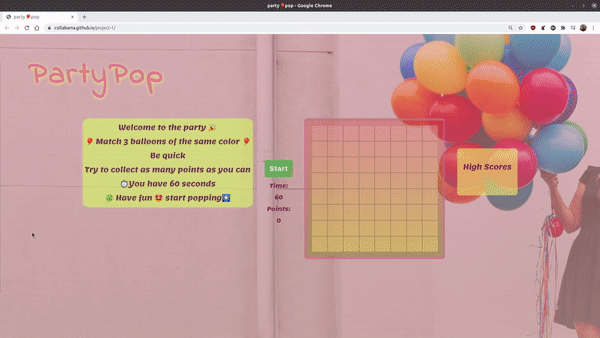
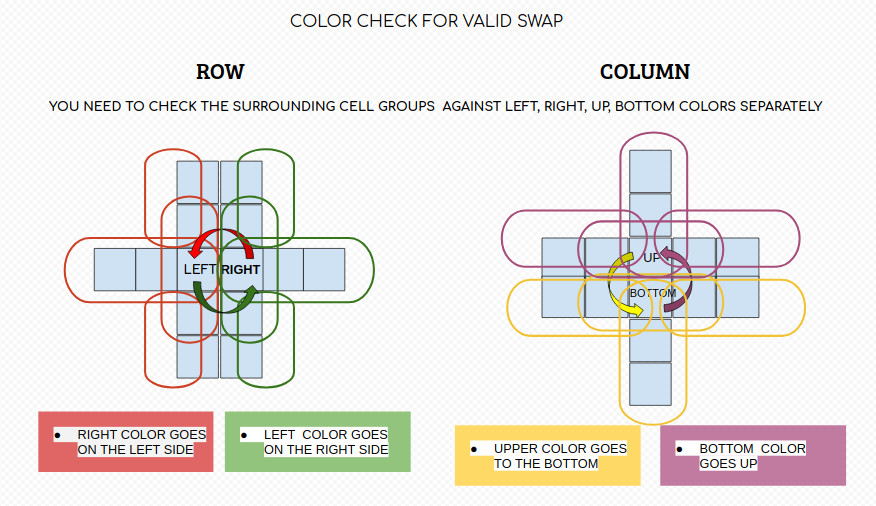

# 🎈partyPop🎈
 
# Overview
 
 
This was a one week solo project with the idea to recreate an existing game using only HTML, CSS and vanilla JavaScript. Therefore I haven't used any frameworks or pre-built components. This made sure that I had to create logic from scratch and get comfortable with JavaScript and DOM relationships.
I decided to make a Candy Crush inspired game.
 
You can find my deployed game here: [partyPop🎈](https://csillabarna.github.io/project-1/)
 
 
## Brief
 
- Render a game in the browser
- Include separate HTML / CSS / JavaScript files
- Use vanilla Javascript for DOM manipulation
- Display results in the end
- Deploy your game online
 
 
## Technologies used
- HTML5
- CSS3
- JavaScript
- Git and GitHub
- Google Fonts
 
## The Game
Candy Crush is a game where players swap colored pieces of candy on the board to make a match - of three or more of the same color in either a row or column. Players can only swap candies on the board as long as it will make a 'crush'. They can't swap two candies if it won't create a row or column of candies of the same color. New random candies are generated at the top so there is a continuous fall.
 
I've given my game a creative spin of a  balloon design.

 

## Approach
 
### Pseudocoding and basic structure
 
1. make an `n*n` grid
2. with `forEach` fill the board with random colors on initial load
3. implement crush for rows
- check with a loop from `index 0`, that `[i, i+1, i+2]` has a same color class
   - if `true` then remove the color class from the cells `and` if cell is on the top row, randomly assign a color to it
     
    - `else` assign the color from the above cell and clear that and repeat
    add points to the score counter

4. implement crush for columns
 -  try to use the same logic than above but with `[i,i+width,i+width*2]` elements
5. recursively repeat step 3 and 4 until no more crushes are found
6. add click events for swapping
   - on first click add a 'clicked' class to the event target
   -  on the second click detect `if` it was a neighbor cell `and` would make a crush
         - if `true` - then swap the color class and make the crush
       - if `false` - shake the second clicked cell and  remove the 'clicked' class from the first click target cell
 
7. create a game timer with `setInterval()`
8. make and display score counter
9. add high score table with `localStorage`
 
 
## Challenges
 
I feel the most difficult part was to check the surrounding colors around the first and second clicked cells. To determine if swapping them would make a crush.

The graphic and the code snippet below helps to understand the logic behind the `colorCheck` function.
 
``` javaScript
function colorCheckRow(leftId, leftColor, rightId, rightColor) {
 const checkAgainstLeft = [
   [cells[rightId + 1], cells[rightId + 2]],
   [cells[rightId - width], cells[rightId - width * 2]],
   [cells[rightId + width], cells[rightId + width * 2]],
   [cells[rightId + width], cells[rightId - width]]
 ]
 for (let i = 0; i < checkAgainstRight.length; i++) {
   if (checkAgainstRight[i][0] && checkAgainstRight[i][0].classList[0] === rightColor
     && checkAgainstRight[i][1] && checkAgainstRight[i][1].classList[0] === rightColor) {
     return true
   }
 }
 return false
}
```
 

 
### Bugs
 
- You can play even after the time is up and haven't hit start yet
 
 
## Enhancements
 
In terms of future improvements, I would like to implement some more levels which increase in difficulty and also add some of the special candies that come with crashing more than 3 candies in one go.
- change click to drag & drop
- add music/more effects

## Lessons Learned
 - make mistakes and how to correct them - debugging 
 - use `DOM manipulation` more comfortably 
 - project management, working to deadlines
 - deploy project on GitHub

## Summary
I feel there is certainly more work that can be done on the project, largely focusing on minimizing hardcoded areas so that the difficulty or the map can be changed at ease without breaking anything.

Overall I had a lot of fun building the game  definitely  had its challenges as there are quite a lot of things going on at the same time. This project is an important part of building a stronger foundation of my HTML, CSS and JS skills.
 
 
 
 

